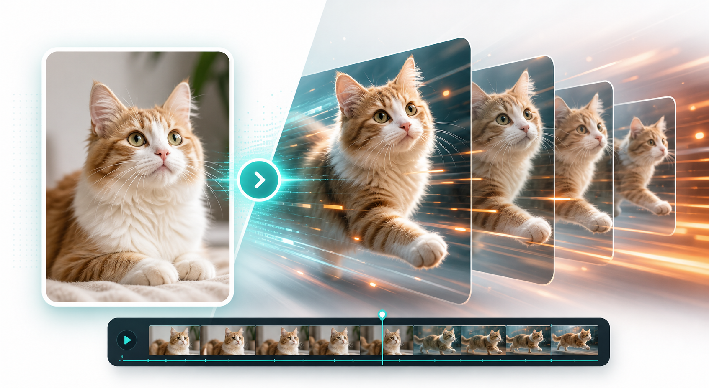
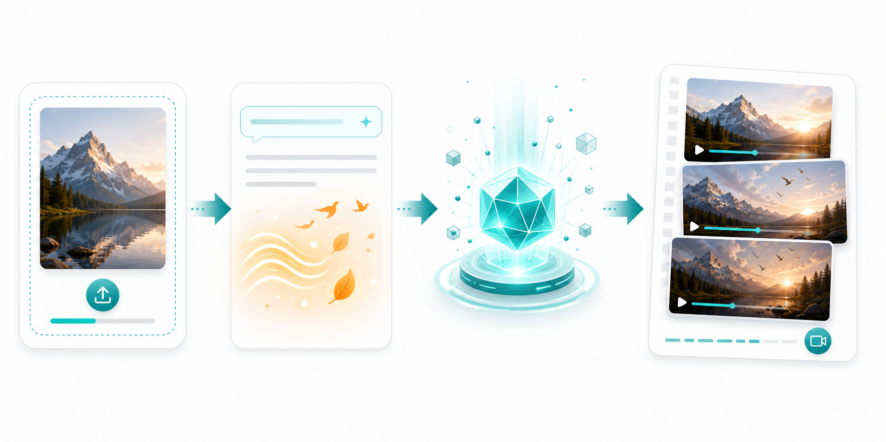
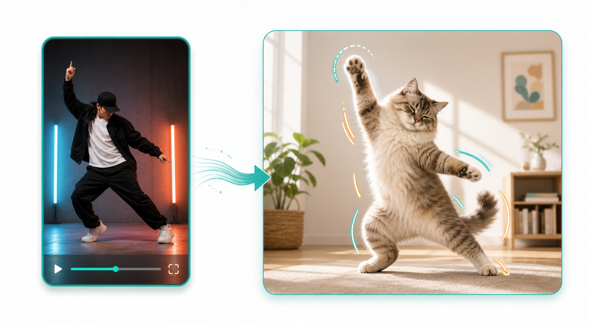

# Free Image to Video AI Guide

This repository is a practical guide to creating videos from a single image with free or low-cost AI tools.

It is written for creators, indie hackers, marketers, and beginners who want to:

- turn a photo into a short video
- make a character move naturally
- create cat videos, dance clips, or meme-style animations
- understand when to use image-to-video vs motion control
- avoid the most common prompting mistakes

Live tool: [ImageToVideoAIFree.com](https://imagetovideoaifree.com)



## What Is Image to Video AI?

Image to video AI converts a still image into a short moving clip. Depending on the workflow, the model can:

- animate a face or character
- add camera movement
- create subtle body motion
- follow a prompt such as "the cat starts dancing under neon lights"
- follow a reference motion clip for stronger control

In practice, there are two common workflows:

1. **Prompt-driven image to video**
   You upload an image, add a prompt, and let the model imagine the movement.
2. **Motion control**
   You upload an image plus a reference motion clip, and the model tries to transfer that motion to your subject.



## When To Use Image to Video vs Motion Control

### Use image to video when:

- you want fast results
- you only have one image
- the motion can be simple or cinematic
- you are making short social clips, reaction content, or vibe edits

### Use motion control when:

- you want to mimic a dance, pose, or body rhythm
- you need more consistent movement
- you want to recreate a viral choreography with a different subject
- you are making "same motion, different character" content



## Quick Start

### Step 1: Choose a clear source image

The best source image usually has:

- one obvious subject
- clean lighting
- a visible face or body
- enough space around the subject
- limited background clutter

Good examples:

- a cat standing on a chair
- a portrait photo with clear shoulders and face
- a full-body character image

Weak examples:

- blurry images
- tiny subjects in the distance
- busy collages
- multiple overlapping people or animals

### Step 2: Decide the kind of movement

Before you generate, decide which kind of result you want:

- **Subtle motion**: blinking, breathing, hair movement, slow camera push
- **Character motion**: talking, waving, walking, dancing
- **Style motion**: dreamy, cinematic, anime-like, dramatic lighting shift
- **Reference-based motion**: copying the rhythm of a dance or action clip

### Step 3: Write a focused prompt

Good prompts are concrete. They describe:

- who or what moves
- how they move
- camera feeling
- lighting or mood
- what should stay stable

Prompt template:

```text
[subject], [main action], [secondary motion], [camera style], [lighting], [mood], high consistency, natural movement
```

Examples:

```text
A fluffy orange cat dancing on a wooden table, small paw movements, playful body bounce, medium shot, warm indoor lighting, funny and energetic, natural movement
```

```text
A portrait of a young woman turning slightly toward the camera, soft blinking, subtle hair movement, gentle camera push-in, golden hour light, cinematic and realistic
```

```text
A robot barista making coffee, smooth arm motion, steam rising from the cup, stable framing, bright cafe light, polished commercial look
```

## A Simple Free Workflow

You can follow this workflow with most modern image-to-video tools:

1. Start with one clean image.
2. Pick either prompt-based animation or motion control.
3. Generate a short preview first.
4. Adjust the prompt if motion is too weak or too chaotic.
5. Regenerate with stronger action words or a better source image.
6. Export the best clip and edit it for TikTok, Reels, or Shorts.

For an online workflow, you can try:

- [Free AI Video Generator](https://imagetovideoaifree.com/ai-video-generator)
- [Motion Control](https://imagetovideoaifree.com/motion-control)
- [AI Dance Effect](https://imagetovideoaifree.com/ai-video-effect/ai-dance)

## Best Prompt Patterns

### 1. Subtle cinematic motion

Use this when you want the image to feel alive without turning into a meme.

```text
A realistic portrait, subtle blinking, slight head movement, soft hair motion, gentle camera push-in, natural cinematic lighting, stable identity, realistic motion
```

### 2. Social content motion

Use this for fun, quick clips.

```text
A cute black cat dancing with upbeat rhythm, paw gestures, tiny body hops, front-facing medium shot, bright room, playful energy, clean and consistent motion
```

### 3. Product or brand motion

Use this for commercial visuals.

```text
A luxury perfume bottle rotating slowly on a reflective surface, floating particles, elegant camera orbit, soft studio lighting, premium cinematic ad style
```

### 4. Motion control recreation

Use this when your subject should follow an external movement pattern.

Recommended setup:

- source image: clear full-body subject
- reference clip: short motion with readable body movement
- prompt: describe the subject and the style, not every frame

Prompt example:

```text
A fluffy white cat follows the reference dance motion, expressive paw movement, playful full-body rhythm, clean indoor lighting, funny but natural result
```

## Common Mistakes

### 1. The prompt is too vague

Bad:

```text
Make it move
```

Better:

```text
A tabby cat starts dancing with small paw waves and a light bounce, funny and natural motion
```

### 2. The source image is weak

If the original image is blurry or crowded, the video model has less structure to preserve.

### 3. Too many actions in one prompt

Bad:

```text
The cat dances, spins, flies, laughs, changes clothes, and the camera circles rapidly
```

This often creates unstable output.

### 4. Expecting motion control from a plain prompt

If you need a specific dance or body rhythm, use a reference motion clip. A text prompt alone is usually not enough.

## Best Use Cases

- viral cat and pet videos
- creator-style dance remakes
- talking portraits
- meme animation
- before/after character transformations
- product teaser loops
- short ad creatives
- AI showcase clips for landing pages

## FAQ

### Can I make image to video AI for free?

Yes. Many tools offer free previews, free credits, or limited daily generations. The tradeoff is usually watermark, slower queue, or shorter duration.

### What is the difference between image to video and text to video?

Image to video starts from an existing image and preserves more subject identity. Text to video starts from a text description and gives the model more freedom.

### What is motion control?

Motion control is a workflow where you use a reference clip to guide the movement of the generated video. It is useful when you want stronger control over dance, pose, or action.

### Why does my result look unstable?

Common reasons:

- unclear source image
- too much motion in the prompt
- conflicting style instructions
- the subject is partially hidden
- the reference motion is too complex

## Suggested Content Angles

If you want to use this guide for growth or SEO, these are strong follow-up topics:

- how to make a cat dance with AI
- best free image to video AI tools
- image to video AI prompts that actually work
- motion control tutorial for TikTok creators
- how to recreate a viral dance with AI

## Try The Live Tool

If you want to test the workflow directly in a browser, start here:

- [Image to Video AI Generator](https://imagetovideoaifree.com/ai-video-generator)
- [AI Lip Sync](https://cal.com/ai-lip-sync)
- [Motion Control Tool](https://imagetovideoaifree.com/motion-control)

## License

MIT
